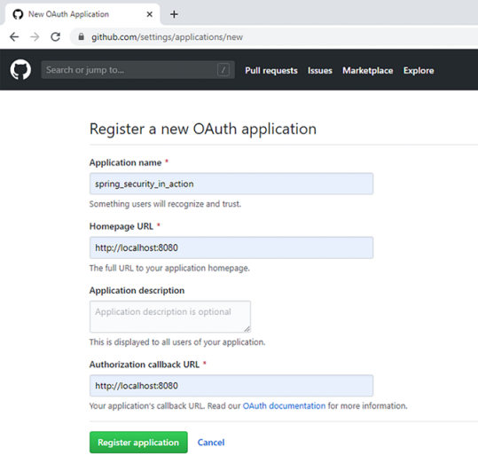

# OAuth2
* là khung uỷ quyền (giao thức uỷe quyền) với mục đích cho phép các trang web, hoặc ứng dụng bên thứ 3 truy cập tài nguyên
* tách biệt trách nhiệm quản lý thông tin xác thực trong 1 thành phần của hệ thống (máy chủ uỷ quyền)

# Các thành phần trong Oath2
  * Resource server: máy chủ tài nguyên, là 1 ứng dụng lưu trữ tài nguyên do người dùng sở hữu 
  * User: người dùng, là cá nhân sở hữu tài nguyên được cung cấp bởi resource server. Thường sử dụng username và passwword để nhận dạng bản thân
  * Client: máy khách, là 1 ứng dụng được phép thay mặt user truy cập các tài nguyên mà họ sở hữu. Client sử dụng client ID và client secret để nhận dạng chính nó. Những thông tin này khác với thông tin đăng nhập của user. Client cần nó để nhận dạng chính nó khi tạo request.
  * Authorization server: máy chủ uỷ quyền, là ứng dụng cho phép client truy cập vào tài nguyên mà user sử hữu được cung cấp bởi resource server. Khi authorization server quyết định rạng client được uỷ quyền truy cập vào tài nguyên thay mặt user, nó phát hành 1 token. Client sử dụng token để chứng minh với resource server rằng nó được uỷ quyền bởi authorization server. Resource server cho phép client được truy cập vào tài nguyên mà nó yêu cầu nếu nó có token hợp lệ

# Các cách triển khai OAuth2
### Authorization code grant type: 
* Các bước:
 1: Client chuyển hướng user tới endpoint của authorization server, client gọi authorization endpoint với request query bao gồm:
   - response_type : "code". Nói với authorzation server rằng client mong đợi 1 code, code này sử dụng để lấy token
   - client_id : giá trị của client id, là giá trị xác định chính client thực hiện request
   - redirect_uri: uri để authorization server chuyển hướng user sau khi xác thực thành công (có thể có hoặc không tuỳ trường hợp authorization server đã đc xác định uri chuyển hướng mặc định)
   - scope : quyền được cấp (read, write, delete, ...)
   - state : giá trị csrf token, sử dụng cho việc bảo vệ csrf
 2: User tương tác trực tiếp với authorization server, thực hiện xác thực (không giử thông tin đăng nhập tới client), khi xác thực thành công, Authorization server gọi lại redirect_uri về Client, cung cấp giá trị authorization code và giá trị state.
 3: Client kiểm tra state đúng với giá trị state đã giử ban đầu, đảm bảo không phải 1 bên thứ 3 gọi tới redirect_uri để đánh cắp client_secret. Khi xác nhận được đúng redirect_uri được gọi từ phía authorization server, client sử dụng authorization code nhận được thực hiện gọi 1 lần nữa tới endpoint của authorization server để nhận token với request query bao gồm:
   - code : giá trị authorization code vừa nhận được
   - client_id và client_secret : thông tin xác thực của client
   - redirect_uri
   - grant_type : "authorization_code".  xác định loại grant được sử dụng (authorization server có thể hỗ trợ nhiều loại grant)
 4: Authorization server nhận request từ client
   - client_id và client_secret chứng minh client là cùng 1 client đã gọi tới endpoint của authorization
   - code chứa authorization code chứng minh user đã xác thưc
  => authorization server gửi access_token cho client
 5: Client nhận access_token sử dụng để đặt giá trị với key là Authorization trong header của request, giử tới resource server để lấy tài nguyên cho user

* Tại sao không giử luôn giá trị access_token ngay lần request đầu tiên từ client tới authorization server?
  - thực tế là có 1 grant type : implicit grant type sẽ trực tiếp trả về access_token cho client, tuy nhiên grant type này không được khuyến nghị sử dụng, hầu hết các authorization servers nổi tiếng cũng không cho phép. Bởi vì authorization server khi gọi tới redirect_uri với access token mà không đảm bảo rằng nó có phải là client đúng để được phép nhận. Client cần chứng minh lại chính nó sau khi nhận authorization_code bằng thông tin xác thực của nó (client_id, client_secret) để nhận được access_token

* Grant type này có 1 điểm yếu rằng, nếu ai đó chặn authorization_code, và người đó cũng lấy được thông tin xác thực của client (bằng cách nào đó) 
   => cần tìm hiểu PCKE authorization code grant type 

### Password grant type:
* Tương tự như authorization code grant type, tuy nhiên thay vì tương tác trực tiếp giữa user và authorization server để xác thực, user giao thông tin xác thực (gồm password) cho client
  * client sẽ xác thực thay user với authorization server
  * khi xác thực thành công, authorization trực tiếp giử access_token tới client
  * sử dụng luồng xác thực này chỉ khi client và authorization server được xây dựng và duy trì bởi cùng 1 tổ chức
* Grant type này kém bảo mật hơn authorization code. Chủ yếu bởi vì user chia sẻ thông tin đăng nhập của mình tới client app. Nó được dùng trong các tình huống thực tế do nó đơn giản hơn authorization code
* Chỉ sử dụng quy trình này nếu client à authorization server được duy trì bởi cùng một tổ chức. User chỉ mong đợi 1 biểu mẫu đăng nhập và để client lo việc giử thong tin đăng nhập đó đến authorization server. User không cần biết việc xác thực xảy ra như thế nào bên trong ứng dụng.
* Các bước:
 1: Client thu thập thông tin đằng nhập và gọi authorization server để lấy access_token. request client giử đi bao gồm:
   - grant_type: "password"
   - client_id và client_secret: thông tin xác thực được client sử dụng để xác thực chính nó
   - scope: là các quyền được cấp
   - username và password: là thông tin đăng nhập của user. được giử đến dưới dạng plain text là các giá trị trong request header
 2: Client nhận lại access token trong response, sử dụng token đó để gọi đến các endpoint trên resource server. token được thêm vào header của request với key là Authorization

### Client credentials grant type:
* Được sử dụng khi không có user tham gia vào quy trình xác thực.
* Giả định rằng hệ thống xác thực bằng OAuth2, cần cho phép 1 server bên ngoài xác thực và gọi tới 1 tài nguyên cụ thể mà server của mình cung cấp.
* Các bước:
 1: Client giử request tới authorization server bao gồm:
   - grant_type: "client_crednetials"
   - client_id và client_secret: là thông tin đăng nhập của client
   - scope: đại diện cho các quyền được cấp
 2: Client nhận được một token. Sử dụng token để gọi tới endpoint của resource server. token được thêm vào header của request với key là Authorization

### Sử dụng refresh_token để nhận access_token mới
* access_token được sử dụng trong OAuth 2 không quan trọng 1 cách triển khai cụ thể nào cho nó, nó đều có hạn sử dụng. Tuổi thọ của access_token có thể là vô hạn, nhưng nên làm cho nó càng ngắn càng tốt. Khi access_token có tuổi thọ vô hạn làm cho nó tương tự với thông tin đăng nhập của user, token này có thể sử dụng để nhận được tài nguyên từ resource server mọi lúc. Trong khi access_token chỉ được đính kèm dưới dạng 1 http header trên mỗi request, việc token này bị đánh cắp tương tự việc thông tin đăng nhập củ user bị lộ.
* Vì vậy tuổi thọ của access_token nên làm cho cằng ngắn càng tốt. Khi access_token hết hạn, user cần đăng nhập lại và lấy 1 access_token mới. Ngay cả khi sử dụng password grant type, client cần phải lưu thông tin đăng nhập của user.
* refresh_token đại diện cho giải pháp thay thế việc sử dụng thông tin đăng nhập để lấy access_token mới.
* refresh_token được authorization server trả về cùng với access_token khi sử dụng các luồng xác thực như authorization code hoặc password grant type. Client sử dụng refesh_token để đưa ra request tới Authorization khi access_token hết hạn, bao gồm:
  - grant_type: "refresh_token"
  - refresh_token: giá trị của token
  - client_id và client_secret: thông tin đăng nhập của client
  - scope: xác định các quyền được cấp. Nếu cần nhiều quyền được cấp hơn, cần xác thực lại.
* Nhận được request, authorization server sẽ phát hành refresh_token và access_token mới

# Thực hiện 1 application đơn giản (SSO - single sign-on)
* SSO: user xác thực thông qua authorization server và sau đó app giữ user đăng nhập, sử dụng refresh_token. App đại diện cho client trong khung OAuth2.
* Ví dụ sử dụng github như authorization và resource server. Tập trung vào giao tiếp giữa các thành phần trong authorization code grant type.
* App không quản lý người dùng, bất kỳ ai cũng có thể đăng nhập bằng cách sử dụng tài khoản github.
* Github cần biết app mà nó sẽ phát hành token. Vì vậy app cần phải đăng ký với Github authorization server => truy cập link: https://github.com/settings/applications/new
* Cần chỉ định application name, homepage url và authorization callback url (là link mà github sử dụng để gọi lại app sau khi xác thực)
* App chuyển hướng user tới Github để đăng nhập, sau đó Github gọi lại app sửu dụng callback url.
